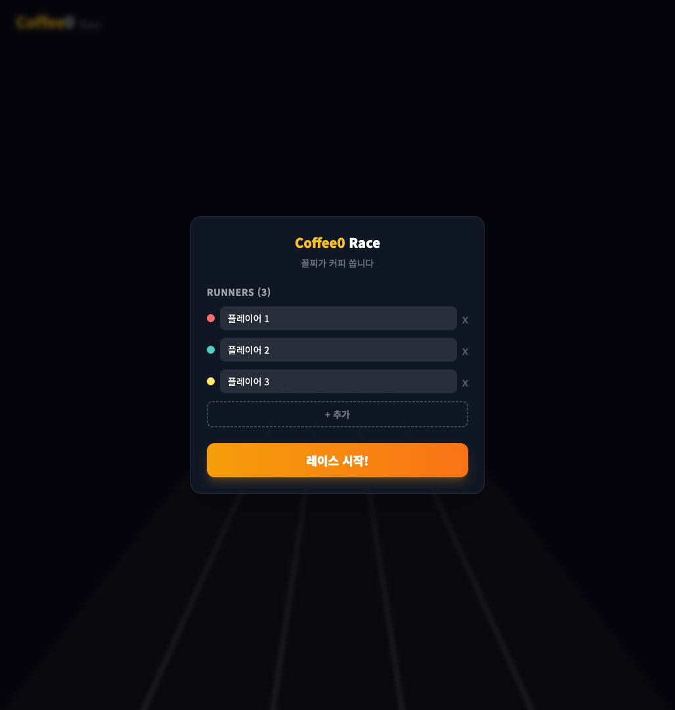
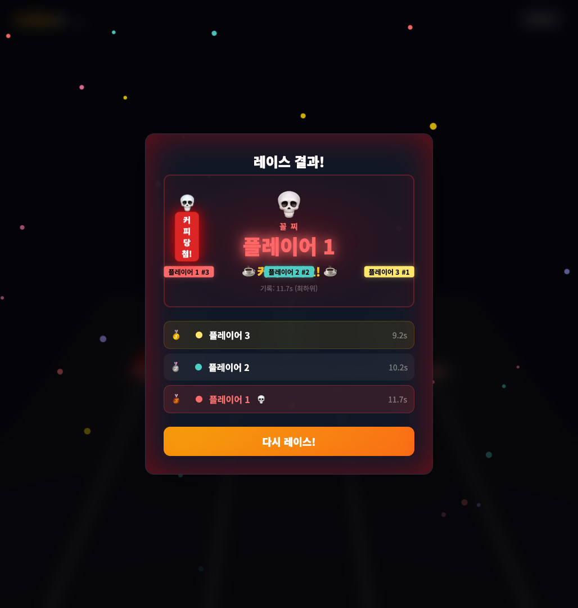

# Coffee0 Race

## 한 줄 소개
> 참가자 이름을 넣고 3D 레이스로 커피 쏠 사람을 뽑는 웹앱

## 문제 정의
여러 명이 커피 내기를 할 때 가위바위보나 사다리타기처럼 간단히 결과를 정할 수 있는 도구가 필요하다.
Coffee0 Race는 참가자를 입력한 뒤 레이스를 시작하면, 3D 트랙에서 참가자들이 달리고 최종 꼴찌를 커피 당첨자로 보여준다.

## 링크
- 서비스: https://coffee0.vercel.app

## 기술 스택
| 영역 | 선택 | 선택 이유 |
|------|------|----------|
| 프론트엔드 | React + Vite | 브라우저에서 바로 실행되는 단일 페이지 앱 구성 |
| 3D 렌더링 | Three.js / React Three Fiber | 3D 트랙과 러너, 레이스 연출 구현 |
| 백엔드 | 없음 | 참가자 입력과 레이스 결과를 클라이언트에서 처리 |
| 배포 | Vercel | 정적 웹앱 배포 |
| AI 활용 | 확인 필요 | 공개된 서비스 화면만으로는 확인 불가 |

## 주요 기능
- 참가자 이름 입력 및 추가/삭제
- 3D 레이스 시작
- 실시간 순위와 이벤트 로그 표시
- 레이스 결과와 커피 당첨자 표시
- 다시 레이스 실행

## 동작 화면

  
  &nbsp;
  

