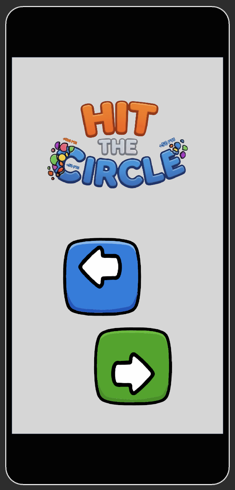
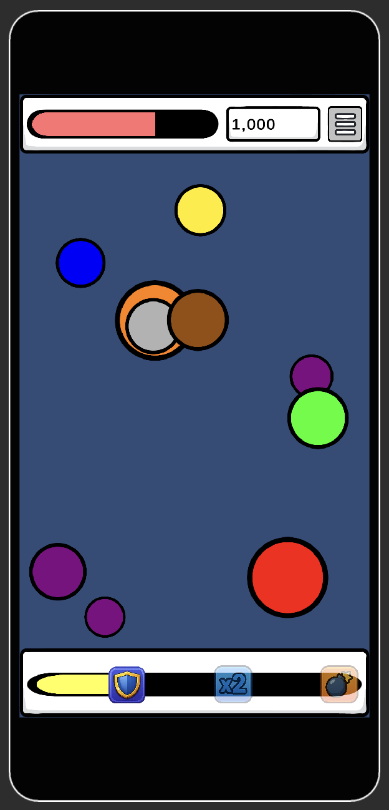
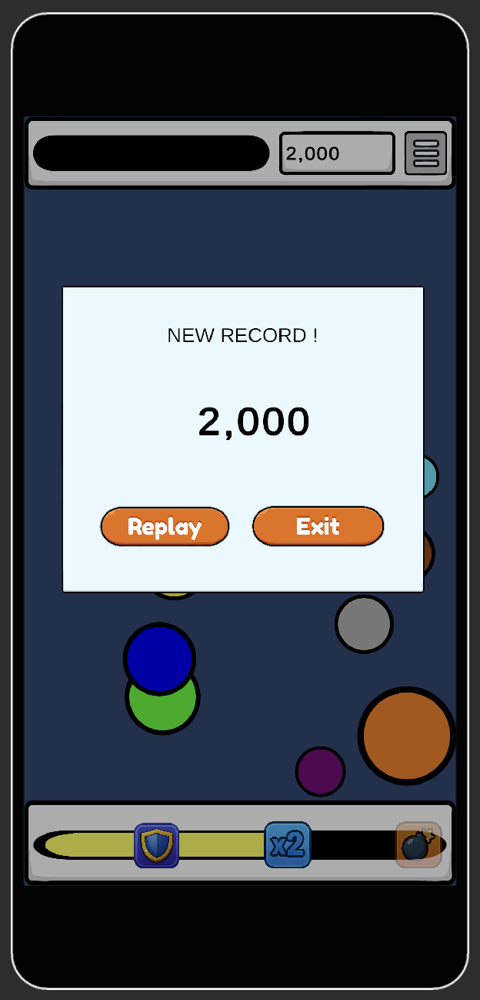

# HTC - Hit The Circle

  
  &nbsp;&nbsp;
  

## 한 줄 소개
> 겹친 원을 클릭하며 점수를 얻어내는 하이퍼캐주얼 게임

## 기능 정의
- 게임 기초 시스템
    + 게임 화면에서는 일정 시간마다 다양한 색과 크기의 원이 생성된다.
    + 모든 원은 멈추지 않고 이동하며, 벽에 부딪히면 튕겨나가며 속도는 유지된다.
    + 같은 색의 원이 2개 이상 겹쳐있을 때, 터치하면 겹쳐진 원을 모두 제거한다.
    + 원 제거를 통해 점수를 얻을 수 있으며, 얻은 점수에 따라 체력이 회복된다.
    + 플레이어의 체력은 지속적으로 감소한다.
    + 플레이어는 최대한 길게 살아남으며 높은 점수를 얻어내야 한다.
- 2가지 모드 제공 (무한, 스테이지 (퍼즐))
- 구글 및 이메일 로그인 제공

## 핵심 피쳐 리스트

- **원 (Circle)**
    - 색상
    - 크기
    - 이동 방향
- **원 생성 기능**
    - 특정 주기마다 원을 랜덤 좌표에 생성
    - 화면에는 최대 10개까지의 원만 존재 가능
- **원 겹침 인식 기능**
    - 같은 색의 원끼리 붙어있는 상태를 인식
- **원 파괴 기능**
    - 조건을 만족하는 원을 터치했을 때 원을 파괴
- **콤보 기능**
- **점수 계산 기능**

## 동작 화면

  
  &nbsp;
  
  &nbsp;
  

## 기술 스택
| 영역 | 선택 | 선택 이유 |
|------|------|----------|
| 게임 엔진 | Unity | Unity 엔진 공부용 (충돌 등의 물리 엔진 다루기, 이펙트 등) |
| 백엔드 | 파이어베이스 | 로그인 및 각종 이벤트에 대한 게임 통계 분석 용 |
| 배포 | 구글 플레이, 앱인 토스 | 앱스토어는 ... 비싸니까 ... |
| AI 활용 | Claude 로 주어진 기능에 대해 전체적인 게임 시스템을 설계하고, cursor로 AI 페어 프로그래밍 |

## 이번 주 작업 내역
- 데이터 모델 레이어 추가
- Game Over Panel UI 추가
- High Score(신기록) 갱신 기능 구현
- 로그인/회원가입 기능 및 UI 완성
- 아이템 바 위치 버그 수정
- 원 색상 팔레트 수정
- 구글 플레이 스토어 제출 완료
