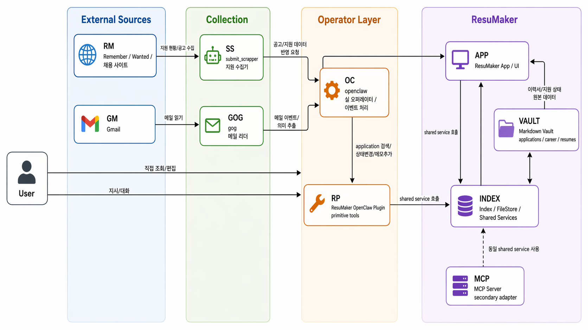

# (가칭) Resumaker에 지원 현황 관리기능 추가

## 한 줄 소개
> Wanted/Remember 지원 현황을 크롤링 도구로 확인하고, 지원 이력 vault에 반영하는 파이프라인

## 문제 정의
구직 과정에서 지원 내역은 Wanted, Remember 같은 채용 플랫폼 별로 다르게 저장됨

이번 주에는 이 흐름을 사람이 직접 확인하는 대신 정형화된 데이터를 만들고 LLM이 확인/정리 할 수 있도록 작업
Week 2에서 비정형 데이터(냉장고를 부탁해)를 LLM으로 바로 정형화하려다 품질이 멀리 날아갔던 경험을 바탕으로, 이번에는 먼저 채용 플랫폼에서 확인 가능한 지원 현황을 구조화된 데이터로 습득하는 경로를 만들었다.
`submit_scrapper`라는 이름으로 사이트별 지원 현황을 JSON/YAML 스키마로 파일 혹은 stdout으로 내보내는 CLI 도구가 됐고, `openclaw-plugin-resumaker`는 openclaw 와 같은 에이전트가 명시된 application ID만 안전하게 수정할 수 있는 도구를 제공한다.
즉, "지원 현황을 확인하는 도구"와 "ResuMaker의 지원 이력을 수정하는 도구"를 분리해서, agent가 검색/조회/생성/상태 변경/메모 추가를 각각 독립 도구로 호출할 수 있게 만든 것이다.

## 구조

## 기술 스택
| 영역 | 선택 | 선택 이유 |
|------|------|----------|
| 지원 현황 수집 도구 | Python, Playwright, uv | Wanted/Remember의 실제 로그인 세션과 브라우저 흐름을 CLI로 호출하기 위해 사용 |
| 사이트별 구현 | site-isolated crawler 구조 | Wanted와 Remember의 DOM/API 차이를 각 사이트 모듈별로 구현해서 사이드 이펙트 방지 |
| 지원 관리 | ResuMaker, Markdown vault | 지원 내역, 상태 이력, 메모, 커버레터를 로컬 파일 기반으로 관리 - 데이터베이스 사용하지 않음 |
| AI 활용 | Codex/OpenClaw | 크롤러 구현, 스키마 정리, 플러그인 primitive 설계, 실제 지원 현황 반영 흐름 검증에 활용 |

## 이번 주 타임라인
| 요일 | 작업 내용 | 소요 시간 |
|------|----------|----------|
| 월 | 지원 현황 데이터 추가 | |
| 화 | MCP 기반으로 모듈 추상화 | |
| 수 | Openclaw Plugin 형태로 모듈 추상화 | |
| 목 | Wanted와 Remember의 지원 현황 크롤러 구현 | |
| 금 | 테스트 및 운용 | |
| 토 | - | |
| 일 | OpenClaw 적용 여정 정리와 회고 작성 | |
